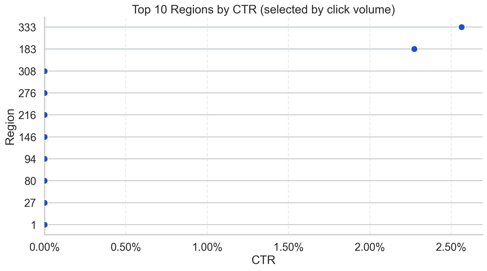
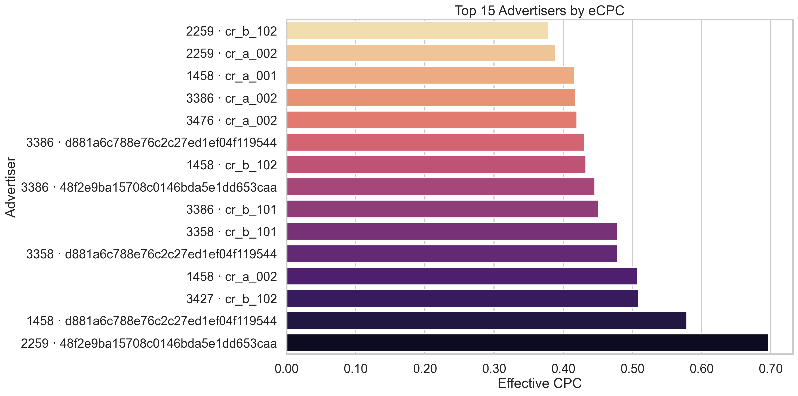
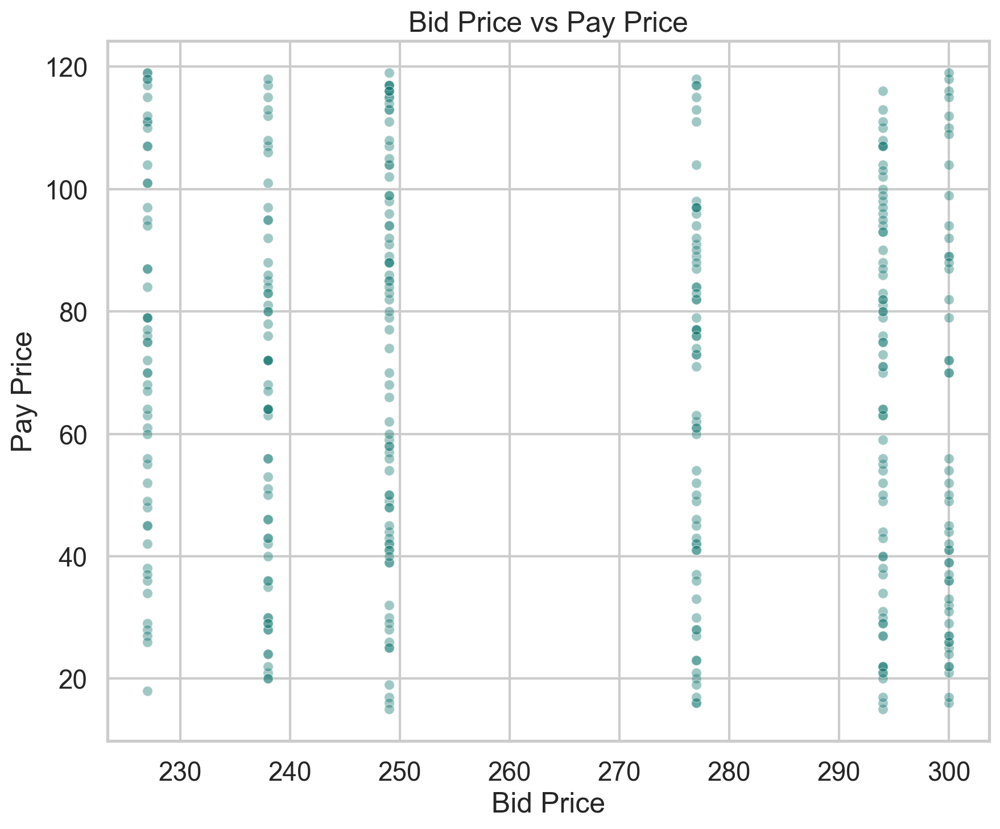
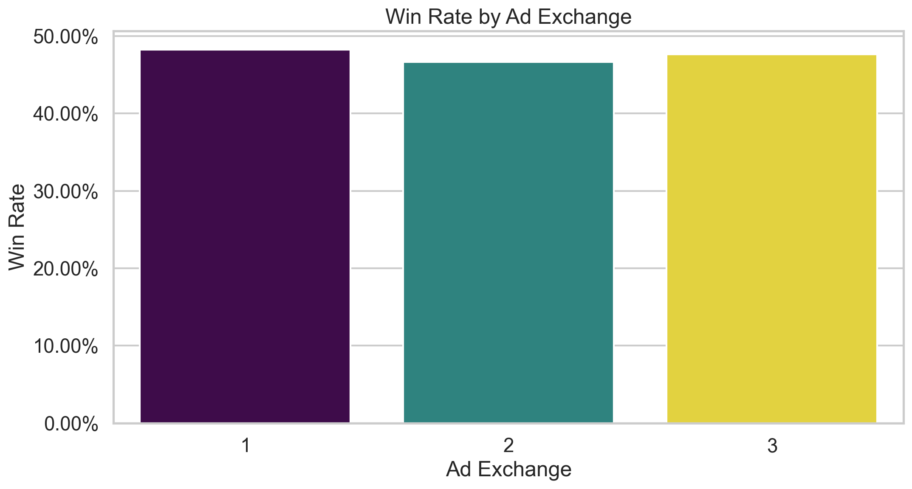

# iPinYou CTR & Campaign Performance Analysis

I built this project as a Python workflow for analyzing RTB campaign performance with the public iPinYou dataset. I combine business-facing performance analysis with CTR modeling so I can see which advertisers, creatives, exchanges, regions, and time windows perform best.

## Project Goals

- Measure campaign performance with metrics such as impressions, clicks, CTR, spend proxy, eCPC, CPM, and win rate.
- Analyze campaign results by hour, weekday, region, city, exchange, advertiser, and creative.
- Study auction efficiency using `bidprice`, `payprice`, and floor-price fields.
- Build and compare CTR prediction models using a logistic regression baseline and a stronger tree-based model.

## Dataset

This repository is designed for the public iPinYou RTB dataset described in the iPinYou competition paper and the public schema released by the benchmark authors.

Expected schema includes fields such as:

- `bidid`
- `timestamp`
- `logtype`
- `ipinyouid`
- `useragent`
- `IP`
- `region`
- `city`
- `adexchange`
- `domain`
- `url`
- `urlid`
- `slotid`
- `slotwidth`
- `slotheight`
- `slotvisibility`
- `slotformat`
- `slotprice`
- `creative`
- `bidprice`
- `payprice`
- `keypage`
- `advertiser`
- `usertag`

The project now works directly with the downloaded raw archive layout:

- `data/raw/ipinyou.contest.dataset/training2nd`
- `data/raw/ipinyou.contest.dataset/training3rd`

These seasons are the default focus because they include `advertiser` IDs and `usertag` fields, which are the most useful for campaign analysis and CTR modeling.

## Business Questions

- Which campaigns and creatives drive the highest CTR?
- Which hours and regions consistently outperform or underperform?
- Which exchanges show better win rates or lower effective CPC?
- How does `bidprice` compare with `payprice`, and where might spend be inefficient?
- Which features are most associated with higher click probability?

## Visualizations

The pipeline saves figures under `outputs/figures/`. Below are example outputs from a pipeline run; each chart highlights a different slice of performance.

### Region CTR comparison

A **lollipop chart** of CTR for the regions with the most clicks (top *N* by volume, then ordered by CTR). I use it to compare relative click rates without relying on a categorical bar axis.



### eCPC by advertiser

Effective CPC for the top advertisers (by clicks). I use it to compare which advertisers pay more per click given the same modeling window.



### Bid price vs pay price

A scatter of bid vs clearing price on a sample of auctions. I use it to see how aggressive bids are relative to what was actually paid and where gaps cluster.



### Win rate by ad exchange

Win rate per exchange. I use it to compare how often impressions clear by supply source and where competition or fill might differ.



## Project Structure

```text
ipinyou-ctr-campaign-analysis/
├── data/
│   ├── processed/
│   └── raw/
├── docs/
│   └── readme/
├── models/
├── notebooks/
├── outputs/
│   └── figures/
├── src/
│   └── ipinyou_analysis/
├── .gitignore
├── EXPERIMENTS.md
├── pyproject.toml
├── README.md
├── requirements.txt
├── run_ctr_experiments.py
└── run_pipeline.py
```

## Methodology

### 1. Data loading and schema profiling

The loader reads raw `bid`, `imp`, `clk`, and `conv` `.txt.bz2` files, joins them by `bidid`, and builds an auction-level modeling table with:

- bid requests
- impressions
- clicks
- conversions
- bid price
- pay price
- campaign and creative metadata

It also profiles the resulting dataset for missingness and cardinality.

### 2. Performance analysis

The analysis layer computes:

- `impressions`
- `clicks`
- `ctr`
- `spend` as `payprice / 1000`
- `eCPC`
- `CPM`
- `win_rate` based on impressions divided by bid requests
- `pay_to_bid_ratio`

### 3. Feature engineering

Modeling features include:

- time fields such as `hour` and `weekday`
- geography such as `region` and `city`
- placement and exchange fields
- auction features such as `bidprice`, `payprice`, `bid_gap`, and `floor_gap`
- derived creative and user context features such as slot area, browser, device type, and user tag count

### 4. CTR modeling

Two models are included:

- Logistic Regression baseline
- Histogram-based Gradient Boosting classifier

Evaluation metrics include:

- ROC AUC
- Average precision
- Log loss
- Brier score

### 5. Generalization experiments (optional)

For portfolio-style reporting, I also run `run_ctr_experiments.py` to evaluate:

- **Season 2 train / Season 3 test** — cross-season robustness (not the official leaderboard test).
- **Within-season temporal split** on `training2nd` — early calendar days vs. later days in the same season.

Framing, file outputs, and CLI flags are documented in [EXPERIMENTS.md](EXPERIMENTS.md).
