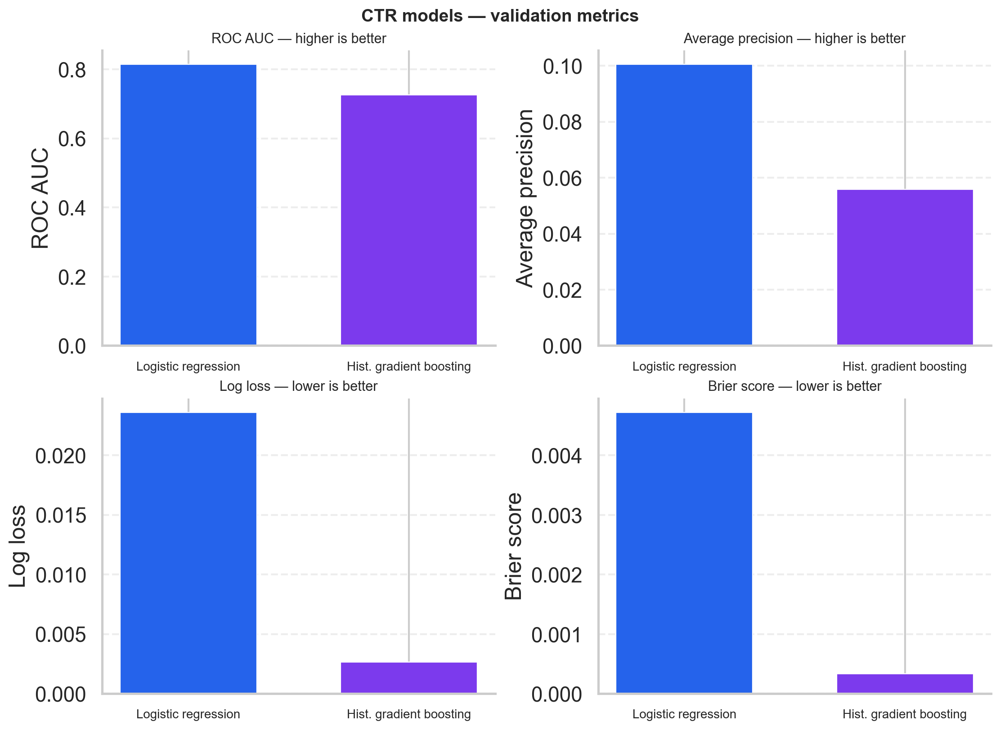
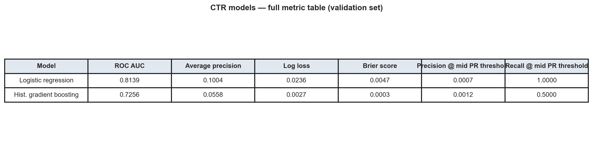

# iPinYou CTR & Campaign Performance Analysis

I built this project as a Python workflow for analyzing RTB campaign performance with the public iPinYou dataset. I combine business-facing performance analysis with CTR modeling so I can see which advertisers, creatives, exchanges, regions, and time windows perform best.

## Project Goals

- Measure campaign performance with metrics such as impressions, clicks, CTR, spend proxy, eCPC, CPM, and win rate.
- Analyze campaign results by hour, weekday, region, city, exchange, advertiser, and creative.
- Study auction efficiency using `bidprice`, `payprice`, and floor-price fields.
- Build and compare CTR prediction models using a logistic regression baseline and a stronger tree-based model.

## Dataset

This repository is designed for the public iPinYou RTB dataset described in the iPinYou competition paper and the public schema released by the benchmark authors.

Expected schema includes fields such as:

- `bidid`
- `timestamp`
- `logtype`
- `ipinyouid`
- `useragent`
- `IP`
- `region`
- `city`
- `adexchange`
- `domain`
- `url`
- `urlid`
- `slotid`
- `slotwidth`
- `slotheight`
- `slotvisibility`
- `slotformat`
- `slotprice`
- `creative`
- `bidprice`
- `payprice`
- `keypage`
- `advertiser`
- `usertag`

The project now works directly with the downloaded raw archive layout:

- `data/raw/ipinyou.contest.dataset/training2nd`
- `data/raw/ipinyou.contest.dataset/training3rd`

These seasons are the default focus because they include `advertiser` IDs and `usertag` fields, which are the most useful for campaign analysis and CTR modeling.

## Business Questions

These are the questions I designed the workflow around, and how I answer them with this repository (outputs depend on how much data you load).

### Which campaigns and creatives drive the highest CTR?

**Answer:** I rank **advertiser–creative–exchange** combinations using `campaign_summary.csv` from `campaign_performance_summary`. Each row includes **impressions**, **clicks**, and **CTR** (`clicks / impressions`). Sorting by **CTR** highlights high-click-rate line items; sorting by **clicks** or **impressions** shows scale. The **eCPC** chart (`campaign_ecpc.png`) complements this by comparing **effective CPC** among high-traffic advertisers so CTR is not read in a vacuum.

### Which hours and regions consistently outperform or underperform?

**Answer:** **Hours:** I aggregate by `hour` via `segment_performance_summary(df, ["hour"])` in notebooks (see `notebooks/01_eda_campaign_analysis.ipynb`) and inspect **CTR** and volume per hour after `build_modeling_frame` / `add_auction_metrics`. **Regions:** **`region_summary.csv`** (from `segment_performance_summary(df, ["region"])`) gives **CTR**, **clicks**, and **impressions** per region so I can compare pockets of strong or weak engagement. There is no single “hour chart” in the default pipeline anymore, but the hour breakdown is a few lines of aggregation in a notebook.

### Which exchanges show better win rates or lower effective CPC?

**Answer:** **`exchange_summary.csv`** (grouped by `adexchange`) includes **win_rate** (wins per bid request) and **eCPC** (`spend / clicks`). **`win_rate_by_exchange.png`** visualizes win rate by exchange. **`campaign_ecpc.png`** is built from campaign-level summaries that include **adexchange**, so I can relate **eCPC** to exchange alongside advertiser. Comparing those tables and charts shows which exchanges clear more auctions and which are pricier per click for the same run.

### How does `bidprice` compare with `payprice`, and where might spend be inefficient?

**Answer:** **`bid_vs_payprice.png`** plots **bid** vs **clearing (pay) price** on a sample of auctions. Points near the diagonal mean bids are close to what was paid; large gaps suggest bids well above clearing. In the summaries, **`pay_to_bid_ratio`** (`avg_payprice / avg_bidprice`) flags segments where clearing is low relative to the bid, which is a useful **spend-efficiency** lens together with **eCPC** and **CPM** in the same aggregate tables.

### Which features are most associated with higher click probability?

**Answer:** The **CTR models** (`train_ctr_models` → logistic regression and histogram gradient boosting) use engineered features such as **hour**, **weekday**, **region**, **city**, **exchange**, **slot** dimensions, **bid/pay** gaps, **device**, **browser**, and **user tag count** (see `features.py` and `modeling.py`). **`model_comparison.csv`** and the **model comparison** figures show **discriminative** quality on the validation set (ROC AUC, average precision, log loss, Brier score). This repo does **not** ship SHAP or coefficient tables by default; for **interpretability** I would add permutation importance or inspect logistic coefficients next—those metrics tell you whether the feature set is predictive, not which single feature ranks first without an extra interpretability step.

## Visualizations

The pipeline saves figures under `outputs/figures/`. Below are example outputs from a pipeline run; each chart highlights a different slice of performance.

### eCPC by advertiser

Effective CPC for the top advertisers (by clicks). I use it to compare which advertisers pay more per click given the same modeling window.


### Bid price vs pay price

A scatter of bid vs clearing price on a sample of auctions. I use it to see how aggressive bids are relative to what was actually paid and where gaps cluster.


### Win rate by ad exchange

Win rate per exchange. I use it to compare how often impressions clear by supply source and where competition or fill might differ.


### Model comparison (CTR)

After training, I compare **logistic regression** and **histogram gradient boosting** on the validation split: a **2×2 bar chart** for ROC AUC, average precision, log loss, and Brier score, plus a **full metrics table** (including precision/recall at a mid PR threshold). The same numbers are in `data/processed/model_comparison.csv`.





## Project Structure

```text
ipinyou-ctr-campaign-analysis/
├── data/
│   ├── processed/
│   └── raw/
├── docs/
│   └── readme/
├── models/
├── notebooks/
├── outputs/
│   └── figures/
├── src/
│   └── ipinyou_analysis/
├── .gitignore
├── EXPERIMENTS.md
├── pyproject.toml
├── README.md
├── requirements.txt
├── run_ctr_experiments.py
└── run_pipeline.py
```

## Methodology

### 1. Data loading and schema profiling

The loader reads raw `bid`, `imp`, `clk`, and `conv` `.txt.bz2` files, joins them by `bidid`, and builds an auction-level modeling table with:

- bid requests
- impressions
- clicks
- conversions
- bid price
- pay price
- campaign and creative metadata

It also profiles the resulting dataset for missingness and cardinality.

### 2. Performance analysis

The analysis layer computes:

- `impressions`
- `clicks`
- `ctr`
- `spend` as `payprice / 1000`
- `eCPC`
- `CPM`
- `win_rate` based on impressions divided by bid requests
- `pay_to_bid_ratio`

### 3. Feature engineering

Modeling features include:

- time fields such as `hour` and `weekday`
- geography such as `region` and `city`
- placement and exchange fields
- auction features such as `bidprice`, `payprice`, `bid_gap`, and `floor_gap`
- derived creative and user context features such as slot area, browser, device type, and user tag count

### 4. CTR modeling

Two models are included:

- Logistic Regression baseline
- Histogram-based Gradient Boosting classifier

Evaluation metrics include:

- ROC AUC
- Average precision
- Log loss
- Brier score

Metrics are written to `data/processed/model_comparison.csv` and visualized as **`outputs/figures/model_comparison_metrics.png`** (bar chart grid) and **`outputs/figures/model_comparison_table.png`** (table figure).

### 5. Generalization experiments (optional)

For portfolio-style reporting, I also run `run_ctr_experiments.py` to evaluate:

- **Season 2 train / Season 3 test** — cross-season robustness (not the official leaderboard test).
- **Within-season temporal split** on `training2nd` — early calendar days vs. later days in the same season.

Framing, file outputs, and CLI flags are documented in [EXPERIMENTS.md](EXPERIMENTS.md).
